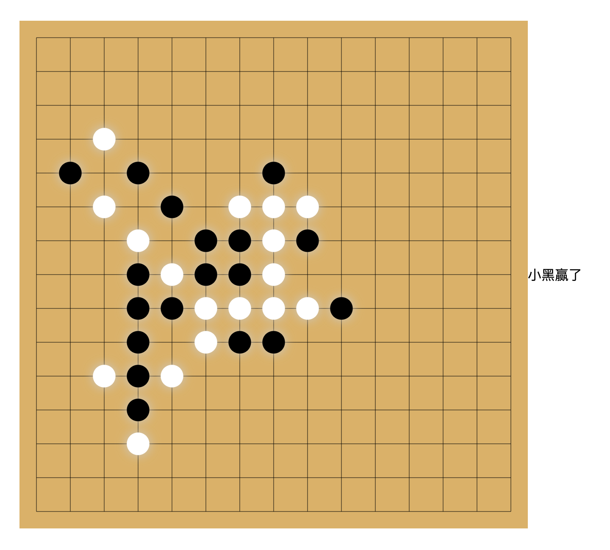

# js手写五子棋

1. 使用面向对象的方式,定义了FiveLine类来封装五子棋的逻辑。
2. 合理的使用了构造函数,初始化了canvas,设置了像素Ratio等属性。
3. 提取出可复用的utils方法,如getLinePoints计算线条坐标,getIntersection计算交点等。
4. 使用Promise封装DrawPiece的异步绘制。
5. 定义了watchWin方法判断是否达成五子连珠。
6. 注释较为完善,代码整体结构清晰。
7. 但是可以继续优化的点:

- [ ] 将绘制棋盘的init方法拆分,可读性更好
- [ ] watchWin方法中 transverse、vertical、slant等方法还可以抽象成独立的工具函数
- [ ] 可以引入一些设计模式,如工厂模式生成棋子,发布-订阅模式处理胜负判断逻辑
- [ ] 可以抽取一些配置项,如棋盘大小、线条数量等进行动态设置

# 效果图

